# Практическая работа №8

## Ход выполнения

1. Создаём директорию [`federation`](federation/) и инициализируем микросервисы и gateway с помощью `npm init -y`.

2. Реализуем схемы для каждого субграфа:

   * [`users`](federation/users-service/src/schema.ts)
   * [`orders`](federation/orders-service/src/schema.ts)
   * [`items`](federation/items-service/src/schema.ts)

   Каждая схема описывает GraphQL API соответствующего микросервиса.

3. Настраиваем для каждого сервиса:

   * подключение к базе данных через Prisma
   * описание моделей и миграций
   * утилиты для работы с бизнес-логикой
   * сервисный слой (controllers/services)

4. Инициализируем и настраиваем PostgreSQL через Docker, подключаем Prisma и выполняем миграции для создания таблиц в базе данных.

5. Тестируем работу каждого субграфа отдельно (GraphQL запросы к users/items/orders сервисам) и проверяем корректность работы базы данных.

6. Реализуем GraphQL Gateway (Apollo Federation / Supergraph):

   * объединяем все субграфы в единый graph
   * настраиваем маршрутизацию запросов
   * описываем context (включая авторизацию и передачу токена между сервисами)

7. Строим supergraph из существующих микросервисов и реализуем единый слой API, обеспечивающий взаимодействие между сервисами через gateway.

8. Создаём `Dockerfile` для каждого микросервиса и для gateway, обеспечивая изолированную сборку каждого сервиса.

9. Настраиваем [`docker-compose`](deploy/docker-compose.yaml):

   * поднимаем все микросервисы
   * поднимаем PostgreSQL
   * настраиваем сетевое взаимодействие между сервисами
   * пробрасываем необходимые порты

10. Деплоим; смотрим `http://localhost:4000/

### Демонстрация лабораторной

[Демонстрация лабораторной по ссылке](https://disk.yandex.ru/i/UY3RljUBN5hZWA)

### Примеры запросов

Запрос на просмотр зарегестрированных методов:
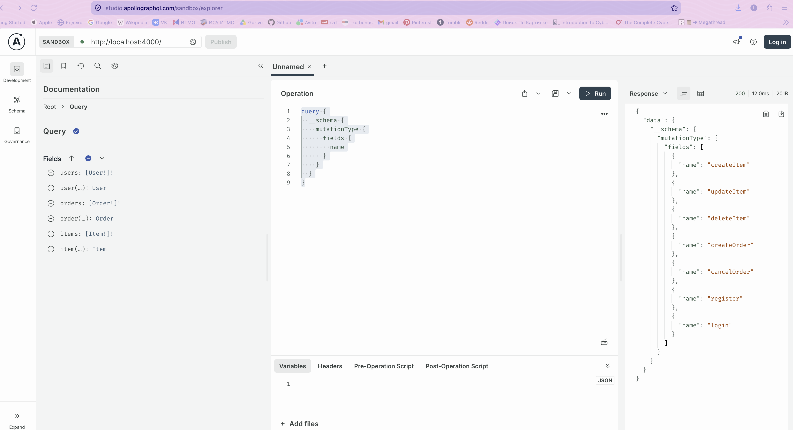

Операции с user:

Register
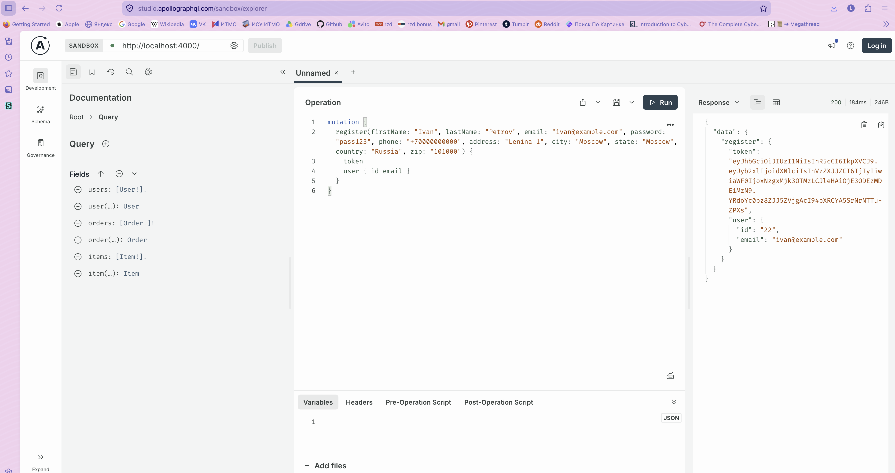

Login
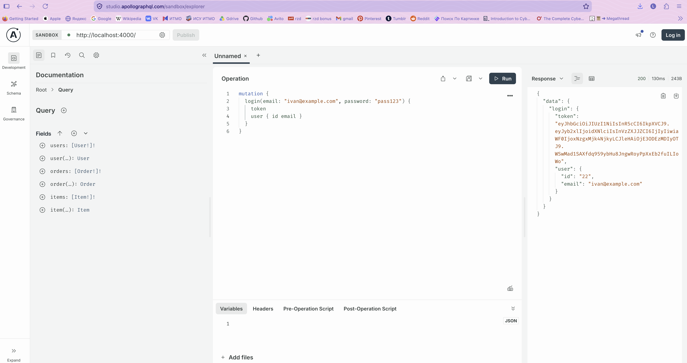

Операции с item:

Create
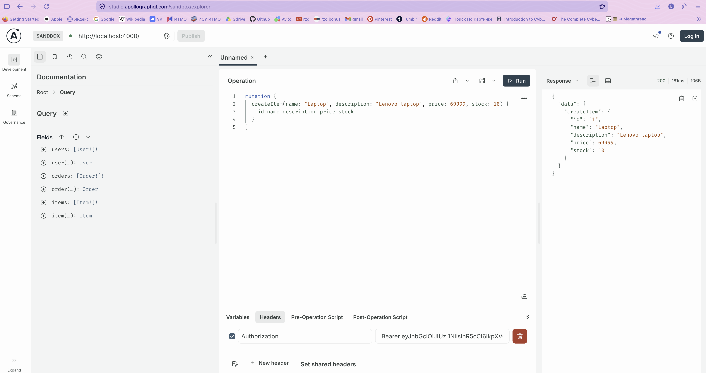

Update
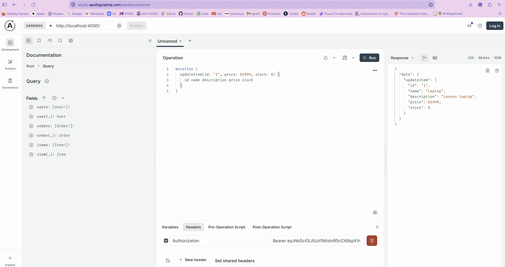

Delete
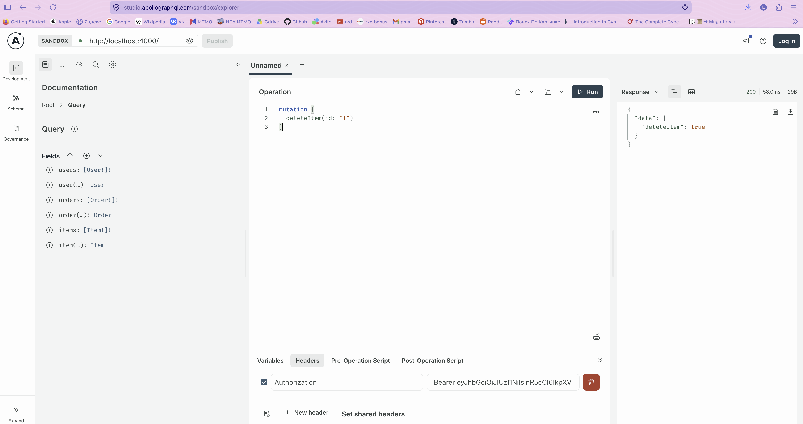

List
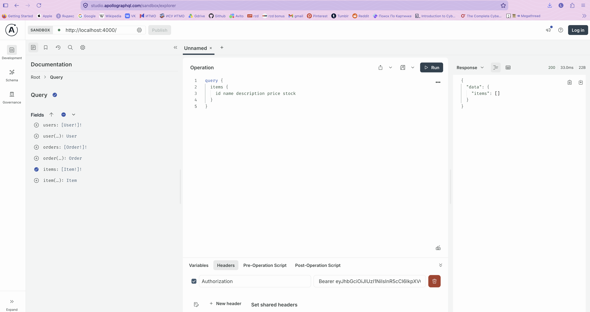

Get
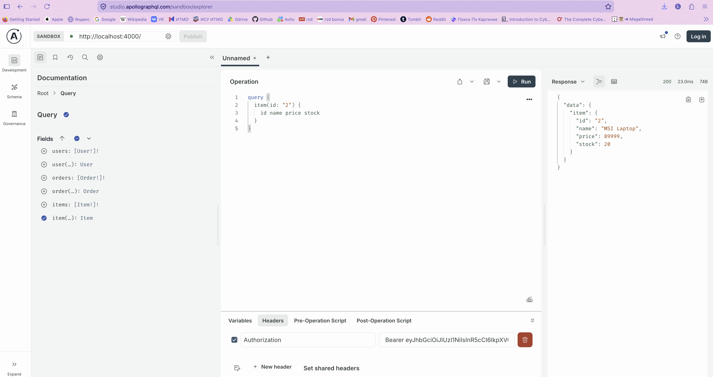

Операции с order:

Create
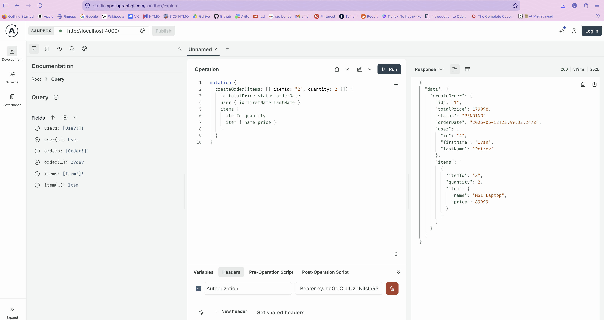

Get
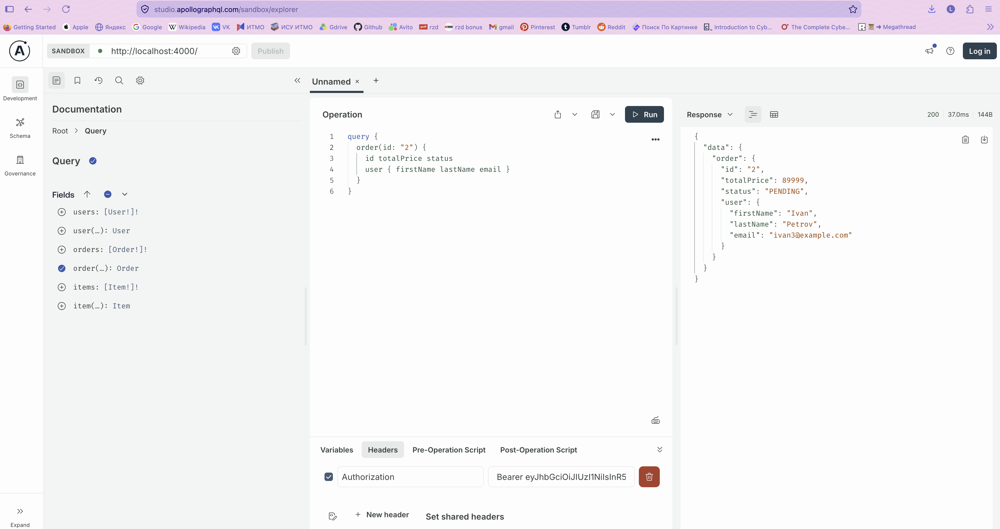

Cancel
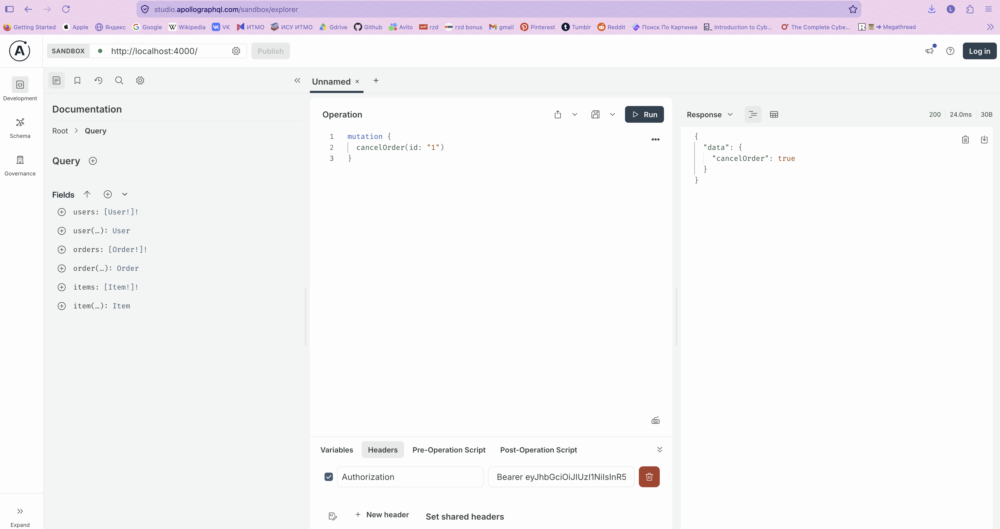

List
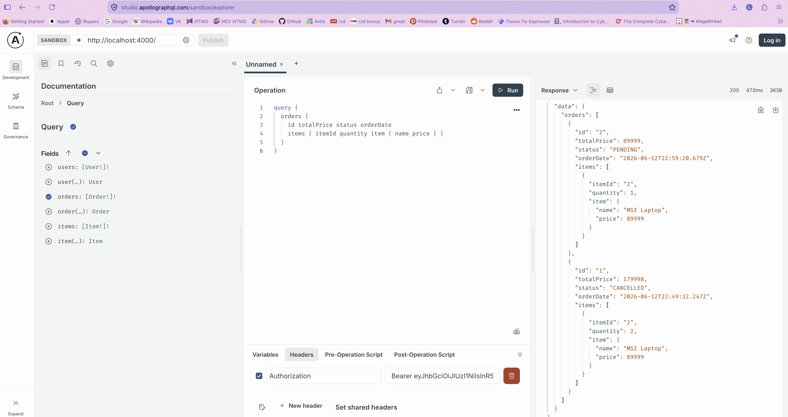

### Frontend

Для приложения фронт React + Apollo Client:

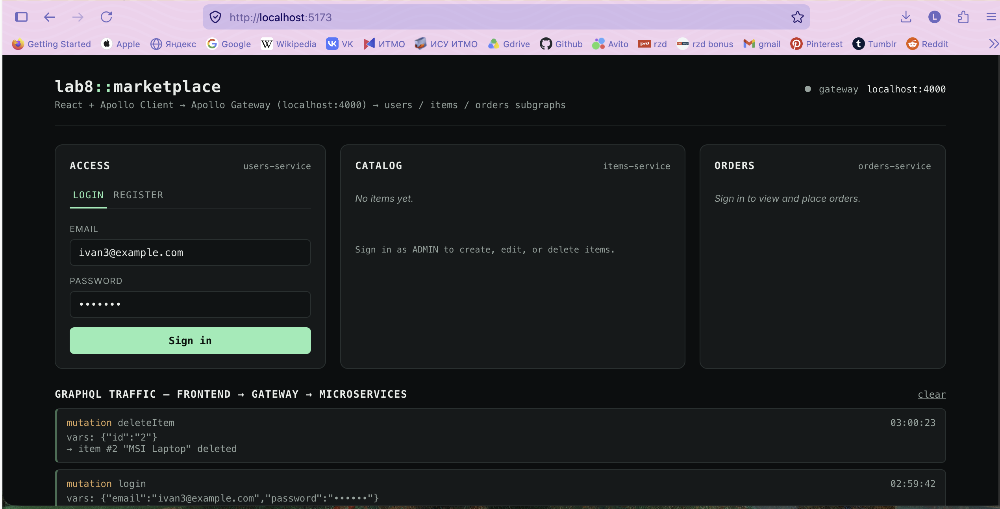

